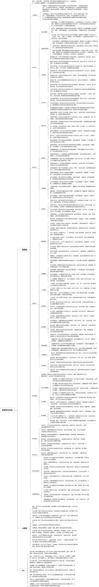

 

    
 

公司拥有上百套具有自主知识产权的软件系统，详情请查看码云首页或公司官网

 
<h1>智慧停车系统</h1>

<a href="https://www.haishi.net.cn/">公司官网</a> ｜ <a href="https://www.haishi.net.cn/">在线体验</a>

 

## 系统介绍

智慧停车场管理系统，包含停车场管理、停车管理、巡查管理等模块
智慧园区的停车场管理系统，包含停车场管理、停车管理、巡查管理等模块
本项目名称为智慧园区停车管理系统，是一款面向园区管理方提供的停车管理软件。
本项目从用户层面可以分为两个端：管理端系统、移动巡检系统
- 管理端系统：公司内部管理员用户使用，可以进行停车场管理、收费规则管理、订单管理、财务对账、运营统计、客服管理、车辆管理、人员管理、设备管理等。
- 移动巡检系统：公司内部巡检员使用，可以进行巡检区域管理、巡检点管理、巡检线路管理、巡检时间段管理、巡检计划管理等。
                

## 系统功能介绍

### 系统包含终端说明

管理端（WEB）、用户端（微信小程序）

| 序号 | 模块                 | 模块说明 |
| ---- | -------------------- | -------- |
| 1    | FWY-ZHTC-ZHYQ-MANAGE | 管理端   |
| 2    | FWY-ZHTC-ZHYQ-MP     | 小程序   |
| 3    | FWY-ZHTC-ZHYQ-H5     | H5端     |
| 4    | FWY-ZHTC-ZHYQ-SERVER | 服务端   |

### 系统功能结构

### 系统功能说明

- 停车场管理：对园区内停车场进行统一管理，包括停车场信息维护、车位状态监控等。
- 收费规则管理：制定灵活的收费规则，例如设置不同时段、不同车型、不同会员等级的收费标准。
- 订单管理：实现对停车订单的自动化管理，包括订单生成、支付、退款等。
- 财务对账：提供详细的财务报表，方便管理人员进行财务对账和运营分析。
- 设备管理：对接入系统的各种硬件设备进行管理，例如停车场出入口闸机、PDA设备等。

## 系统主要界面

## 系统技术说明

### 代码模块说明

| 序号 | 目录                                 | 目录说明 |
| ---- | ------------------------------------ | -------- |
| 1    | FWY-ZHTC-ZHYQ-SERVER/px-mx-generator | --       |
| 2    | FWY-ZHTC-ZHYQ-SERVER/px-mx-admin     | --       |
| 3    | FWY-ZHTC-ZHYQ-SERVER/px-mx-payment   | --       |
| 4    | FWY-ZHTC-ZHYQ-SERVER/px-mx-framework | --       |
| 5    | FWY-ZHTC-ZHYQ-SERVER/px-mx-quartz    | --       |
| 6    | FWY-ZHTC-ZHYQ-SERVER/px-mx-common    | --       |
| 7    | FWY-ZHTC-ZHYQ-SERVER/px-mx-system    | --       |
| 8    | FWY-ZHTC-ZHYQ-SERVER/.idea           | --       |

### 系统技术选型

#### 开发语言/框架

JAVA（JDK1.8）
前端框架：VUE2
其他

#### 服务中间件

Nginx
Tomcat

#### 数据库

MySQL（5.7+）

#### 其他说明

无

## 系统演示/商用

请扫码添加客服微信获取演示地址和系统详细资料。

如果您想基于智慧停车系统进行商业化交付或定制开发服务，我们提供有偿的技术服务支持，合作模式不限，欢迎沟通！

公司官网地址： <a href="https://www.haishi.net.cn/">https://www.haishi.net.cn</a>

联系客服获取专业回答。

## 使用须知

1、 本项目商用必须获得版权所有者的授权。

2、 未经允许本项目代码不允许二次出售。

